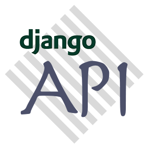

<p align="center"></p>

# Django REST API Template

Django REST API Template for Github Projects

## Using Demo API Server

```
# Dependencies for postgresql client (Not needed for demo purpose)
sudo apt update && \
sudo apt upgrade -y && \
sudo apt autoremove && \
sudo apt install -y libpq-dev python3-dev

# Installing template
git clone https://github.com/nikhiljohn10/django-api-template.git
cd django-api-template/app
python3 -m venv venv && . venv/bin/activate && . bin/api

# To develop
api run

# Edit .env file before deploying

# To deploy
api deploy
```

## CLI Command

```
Usage: $ api OPTION

OPTIONS:

    -c | clean    : Clean project's temp files
    -i | install  : Install python dependencies
    -m | migrate  : Migrate database
    -o | demo     : Load dummy data in to database
    -s | setup    : Initialise and configure API server
    -r | run      : Run development API server
    -d | deploy   : Deploy API server using gunicorn
    -h | help     : Display help

```

**Note:** This command will only work if `. bin/api` is ran from `app` directory

#### Docker
- **start_psql**  : Deploy postgresql standalone docker container
- **stop_psql**   : Stop postgresql container
- **kill_psql**   : Remove postgresql container

#### Internal
 - **make_cert**  : Generate self-signed SSL certificate
 - **clean_cert** : Remove SSL certificate
 - **config_env** : Configure the .env file
 - **reload**     : Reload the CLI script

## Demo
For demo, use the following:

* Username: admin/alice/bob/lucy
* Password: @dmin1234
* Login URL: http://localhost:8000/api/v1/auth/login/


## Contribute
Check out [CONTRIBUTING.md](https://github.com/nikhiljohn10/django-api-template/blob/main/CONTRIBUTING.md) for information about getting involved.

## Code of Conduct
Everyone interacting in the this project's codebases, issue trackers, etc are
expected to follow the [Code of Conduct](https://github.com/nikhiljohn10/django-api-template/blob/main/CODE_OF_CONDUCT.md).

## License
This project is licensed under [MIT License](https://github.com/nikhiljohn10/django-api-template/blob/main/LICENSE)
